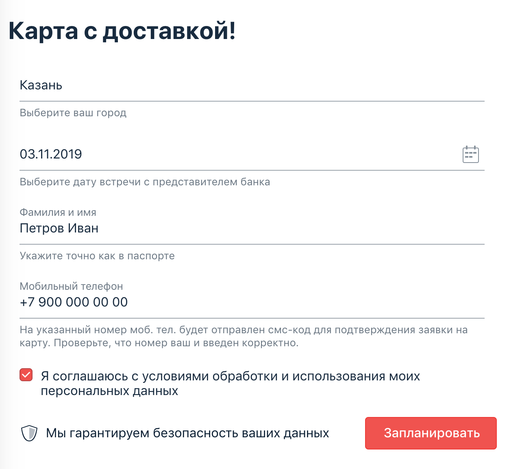

Project **RebookDate** 

Задача №1: 

**"заказ доставки карты (изменение даты)"**

- Вам необходимо автоматизировать тестирование новой функции формы заказа доставки карты:

- Требования к содержимому полей, сообщения и другие элементы, по словам заказчика и разработчиков, такие же, они ничего не меняли.

Примечание: не забудьте это перепроверить, никому нельзя доверять

- Тестируемая функциональность: если заполнить форму повторно теми же данными, за исключением «Даты встречи», то система предложит перепланировать время встречи:

- После нажатия кнопки «Перепланировать» произойдёт перепланирование встречи:

- Важно: в этот раз вы не должны хардкодить данные прямо в тест. Используйте Faker, Lombok, data-классы для группировки нужных полей и утилитный класс-генератор данных — см. пример в презентации.

- Утилитными называют классы, у которых приватный конструктор и статичные методы.

- Обратите внимание, что Faker может генерировать не совсем в нужном для вас формате.
